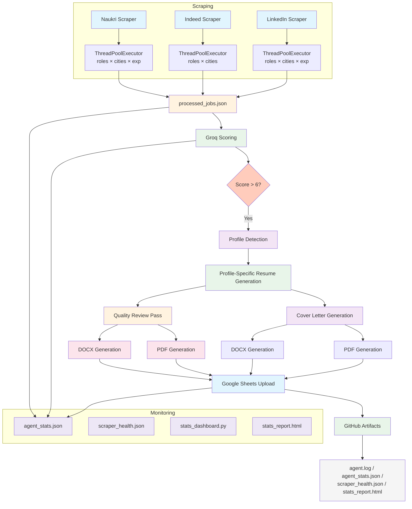

# AI Jobs Agent

AI-powered job application assistant that scrapes jobs from Naukri, Indeed, and LinkedIn, scores them using Groq, and generates recruiter-quality, ATS-optimized tailored resumes and cover letters — fully automated via GitHub Actions.

> **Generates professional, role-specific resumes** for Data Analyst, BI Analyst, Financial Analyst, SAP FICO, AI Engineer, Agentic AI Engineer, ML Engineer, and GenAI/LLM roles.

---

## Features

- **Multi-source job scraping** — Naukri (API), Indeed (HTML), LinkedIn (public job search)
- **Massive combinatorial search** — 27+ roles × 6 cities × 6 experience levels with automatic synonym expansion
- **Parallel scraping** — ThreadPoolExecutor for concurrent searches across combinations and sources
- **AI-powered scoring** — Groq LLM evaluates each job against your CV (0-10)
- **Profile-specific resume generation** — Different resume strategies for 8+ role types
- **ATS-optimized output** — No tables, text boxes, icons, graphics, columns, or headers/footers with important info
- **Professional formatting** — Calibri typography, consistent spacing, proper margins
- **DOCX + PDF output** — Matching visual formatting across both formats
- **Quality review pass** — LLM review catches grammar, tone, ATS issues, hallucinations
- **Cover letters** — Personalized 300-450 word cover letters per role
- **Google Sheets integration** — Tracks applications with match %, prep topics, acceptance chance
- **Intelligent deduplication** — Dedup by company + title + location + posting link; updates edited postings
- **Cached scoring** — `score_cache.json` and `generation_progress.json` persist across runs
- **Date-stamped outputs** — Organized under `outputs/YYYY-MM-DD/`
- **Statistics tracking** — Daily stats saved to `agent_stats.json` with historical data
- **Scraper health monitoring** — Detects broken scrapers (zero jobs for 3+ consecutive runs)
- **Statistics dashboard** — Plotly-based `stats_dashboard.py` generates HTML reports with charts
- **GitHub Actions automation** — Daily scheduled runs with artifact uploads

---

## Architecture



---

## Project Structure

```
AI-Jobs-Agent/
├── config.py                     # Central configuration — all settings in one place
├── main.py                       # Orchestrator: scraping, scoring, generation, upload
├── groq_api.py                   # Groq LLM API client with retry & rate-limit handling
├── prompts.py                    # Profile-specific resume/cover letter prompts (8+ profiles)
├── resume_reviewer.py            # Quality review pass for generated resumes
├── auto_scorer.py                # Automated AI job scoring against CV
├── auth_sheets.py                # Google Sheets OAuth2 flow
│
├── naukri_scraper.py             # Naukri.com job scraper (API v3 + parallel expansion)
├── indeed_scraper.py             # Indeed.com job scraper (HTML parsing + parallel expansion)
├── linkedin_scraper.py           # LinkedIn job scraper (guest API + parallel expansion)
│
├── stats_dashboard.py            # Plotly-based statistics dashboard generator
├── reformat_cv.py                # Utility to reformat existing CVs with new styling
├── deploy.sh                     # Local deployment & run script
├── requirements.txt              # Python dependencies
│
├── processed_jobs.json           # Central job store (all sources merged)
├── score_cache.json              # Cached job scores (persisted across runs)
├── generation_progress.json      # Tracks which jobs already generated CVs/letters
├── agent_stats.json              # Daily run statistics (historical, append-only)
├── scraper_health.json           # Scraper health monitoring data
├── enhanced_cv.txt               # Source CV text (used as factual base)
│
├── .github/workflows/
│   └── daily-agent.yml           # GitHub Actions automation
│
└── outputs/
    └── YYYY-MM-DD/               # Date-stamped generated files
        └── company_title/
            ├── tailored_cv.docx
            ├── tailored_cv.pdf
            ├── cover_letter.docx
            └── cover_letter.pdf
```

---

## Workflow

### 1. Job Scraping
Scrapers collect jobs from Naukri, Indeed, and LinkedIn across **every combination** of:
- **Cities**: Hyderabad, Pune, Bengaluru, Chennai, Remote (India), All India
- **Experience**: Internship, Fresher, 0-1 years, 1-3 years, Mid level, Experienced
- **Roles**: 27+ roles with automatic synonym expansion

**Search expansion:**
| Role | Synonyms Also Searched |
|------|----------------------|
| Business Intelligence | BI, Analytics, Reporting, Dashboard, MIS |
| GenAI | Generative AI, AI Automation, Agentic AI |
| LLM | Large Language Model |
| FP&A | Financial Planning, Financial Planning & Analysis |
| SAP Finance | SAP FICO |
| ... and more | |

Search combinations are scraped concurrently using `ThreadPoolExecutor` (configurable worker count).

### 2. Deduplication
Improved deduplication using:
1. **Posting link** (primary identifier)
2. **company + title + location** (fallback)
3. If a posting is edited (same link, different content), the entry is **updated** instead of skipped

### 3. AI Scoring
Each job is scored against the candidate's CV using Groq LLM (`llama-3.3-70b-versatile`):
- **0-10 scale** based on skills match, experience relevance, education alignment
- Only jobs scoring **> 6** (configurable via `config.py`) proceed to generation
- Results cached in `score_cache.json`

### 4. Profile Detection
The system detects the best-matching resume profile from the job title, category, and description:
- Data Analyst, BI Analyst, Financial Analyst, SAP FICO
- AI Engineer, Agentic AI Engineer, ML Engineer, GenAI/LLM

### 5. Resume Generation
Each profile uses a different prompt strategy:
- **Analyst roles** → Lead with work experience + data tools, then AI projects
- **AI/ML roles** → Lead with AI skills + GitHub projects, then work experience
- **Finance roles** → Lead with finance experience + education, then analytics skills

### 6. Quality Review
Every generated resume passes through a second LLM review that verifies:
- Grammar, spelling, punctuation
- Professional tone
- ATS keyword coverage
- Hallucinations (fabricated information)
- Duplicate content
- Weak bullet points
- Action verb usage

### 7. Output Generation
- **DOCX** — python-docx with Calibri font, professional navy headings, consistent spacing
- **PDF** — fpdf2 with matching DejaVu font, same visual structure

### 8. Google Sheets Upload
Application data logged with headers: Job Title, Company, Match %, Prep Topics, Acceptance Chance %, Status, Date.
Column headers are automatically created if they don't exist.

---

## Statistics System

### Daily Statistics (`agent_stats.json`)
After every run, statistics are saved with a daily entry (historical data preserved):

```json
{
  "date": "2026-06-27",
  "runtime_seconds": 123.4,
  "naukri": { "queries": 0, "pages": 0, "jobs_found": 0, ... },
  "indeed": { ... },
  "linkedin": { ... },
  "total": { "jobs_found": 0, "duplicates": 0, "cv_generated": 0, ... }
}
```

### Console Summary
At the end of every run, a rich summary is printed:
```
==================================================
SCRAPING SUMMARY
==================================================
Naukri:
  Queries executed:   50
  Pages scraped:      120
  Jobs found:         200
  Duplicates removed: 30
  New jobs:           170
  Avg response time:  1.20s
  Health status:      OK
...
==================================================
PROCESSING SUMMARY
==================================================
Jobs scored:         50
Average score:       7.2/10
Recommended:         20
CV generated:        15
Cover letters:       15
Sheets uploads:      15
Sheets failures:     0
Execution time:      5m 30s
==================================================
```

### Statistics Dashboard
```bash
python3 stats_dashboard.py
```
Prints a 30-day summary and generates `stats_report.html` with interactive Plotly charts:
- Jobs scraped per day
- Jobs by source
- CVs generated per day
- Jobs scored & recommended
- Scraper queries over time
- Scraper response times

---

## Configuration

All configurable values are centralized in `config.py`:

| Setting | Default | Description |
|---------|---------|-------------|
| `CITIES` | 6 cities | Target cities for job search |
| `EXPERIENCE_LEVELS` | 6 levels | Experience level filters |
| `ROLES_DATA` | 27+ roles | Keywords with synonyms and categories |
| `MAX_PAGES` | 5 | Maximum pages per search combination |
| `CONCURRENT_WORKERS` | 10 | ThreadPoolExecutor workers |
| `MIN_AI_SCORE` | 6 | Minimum score to proceed to generation |
| `SCORING_MODEL` | llama-3.3-70b-versatile | Groq model for scoring |
| `GENERATION_MODEL` | llama-3.1-8b-instant | Groq model for generation |
| `RATE_LIMIT_NAUKRI` | 1.0s | Delay between Naukri requests |
| `RATE_LIMIT_INDEED` | 2.0s | Delay between Indeed requests |
| `RATE_LIMIT_LINKEDIN` | 2.0s | Delay between LinkedIn requests |
| `MAX_RETRIES` | 3 | General API retry count |
| `HEALTH_CONSECUTIVE_ZERO_THRESHOLD` | 3 | Consecutive zero-job runs before flagging scraper as broken |

---

## Installation

### Requirements
- Python 3.10+
- Groq API Key
- Google Sheets OAuth credentials (optional)

### Python Dependencies
```bash
pip install -r requirements.txt
```

### System Fonts (PDF generation)
```bash
# Debian/Ubuntu
sudo apt-get install fonts-dejavu-core

# macOS — DejaVu fonts are pre-installed
```

---

## Configuration Guide

### 1. Environment Variables
```env
GROQ_API_KEY=gsk_your_groq_api_key
```

### 2. Candidate CV
Create `enhanced_cv.txt` containing your resume in plain text. This is the **sole source of factual information** — nothing will be fabricated.

### 3. Profile-Specific Templates
The system supports these resume profiles in `prompts.py`:
| Profile | Focus | Skill Priority |
|---------|-------|---------------|
| Data Analyst | Analytics, dashboards, SQL | Data Analytics → Viz → AI |
| BI Analyst | BI tools, dashboards, reporting | Viz → Data Analytics → AI |
| Financial Analyst | FP&A, budgeting, forecasting | Finance → Data Analytics → Viz |
| SAP FICO | SAP, FICO, financial systems | SAP → Finance → Data Analytics |
| AI Engineer | LLMs, RAG, LangChain | AI → Programming → Data |
| Agentic AI Engineer | Agents, CrewAI, orchestration | AI → Agentic → Programming |
| ML Engineer | ML, Python, scikit-learn | AI → Programming → Data |
| GenAI/LLM Engineer | Generative AI, RAG, prompts | AI → Programming → Data |

### 4. Google Sheets Setup
```bash
# Step 1: Generate auth URL
python3 auth_sheets.py step1

# Step 2: Visit the URL, authorize, paste the redirect URL
python3 auth_sheets.py step2 "<redirect_url>"
```

---

## GitHub Secrets

| Secret | Description |
|--------|-------------|
| `GROQ_API_KEY` | Your Groq API key (e.g., `gsk_...`) |
| `GOOGLE_CLIENT_SECRET_BASE64` | `base64 client_secret.json` |
| `GOOGLE_TOKEN_JSON_BASE64` | `base64 token.json` |
| `CV_TEXT_BASE64` | `base64 enhanced_cv.txt` |

### Setting up secrets
```bash
# Encode files to base64
base64 -w0 client_secret.json > client_secret_base64.txt
base64 -w0 token.json > token_base64.txt
base64 -w0 enhanced_cv.txt > cv_base64.txt

# Copy the contents into GitHub Secrets (Settings → Secrets → Actions)
cat client_secret_base64.txt
cat token_base64.txt
cat cv_base64.txt
```

---

## Usage

### Local Run
```bash
# Full pipeline: fetch + score + generate
python3 main.py --fetch-naukri --fetch-indeed --fetch-linkedin --auto-score

# Parallel scraping mode
python3 main.py --fetch-naukri --fetch-indeed --fetch-linkedin --auto-score --parallel

# Or run individual steps:
python3 main.py --fetch-naukri --only-naukri      # Fetch only
python3 auto_scorer.py                              # Score only
python3 main.py                                     # Generate only
```

### Statistics Dashboard
```bash
python3 stats_dashboard.py
```

### Deploy Script
```bash
bash deploy.sh --setup    # One-time setup (venv, deps, fonts)
bash deploy.sh --run      # Run the full agent
```

---

## GitHub Actions Automation

The workflow runs **daily at 03:00 UTC** and can also be triggered manually.

### Workflow Steps
1. Checkout repository
2. Setup Python 3.10
3. Install DejaVu fonts (PDF generation)
4. Install Python dependencies
5. Restore cached scores + progress
6. Decode Google OAuth credentials from secrets
7. Decode CV text from secrets
8. Scrape Naukri, Indeed, LinkedIn jobs (each continues on error)
9. Auto-score new jobs with Groq
10. Generate tailored CVs + cover letters
11. Quality review pass
12. Upload to Google Sheets
13. Save updated cache
14. Show generated files
15. **Upload artifacts:**
    - `outputs/**` — generated CVs and cover letters
    - `agent.log` — runtime logs
    - `agent_stats.json` — daily statistics
    - `processed_jobs.json` — all scraped jobs
    - `score_cache.json` — cached scores
    - `generation_progress.json` — generation tracking
    - `scraper_health.json` — scraper health monitoring
    - `stats_report.html` — statistics charts
16. Commit cache files back to repository

### Scraper Health Monitoring
If a scraper returns zero jobs for 3+ consecutive runs, it is flagged as **broken** in `scraper_health.json` and a warning is printed in the console summary.

---

## Output Structure

```
outputs/
└── 2026-06-26/
    ├── accenture_data_analyst/
    │   ├── tailored_cv.docx      # ATS-optimized resume (DOCX)
    │   ├── tailored_cv.pdf       # ATS-optimized resume (PDF)
    │   ├── cover_letter.docx     # Personalized cover letter (DOCX)
    │   └── cover_letter.pdf      # Personalized cover letter (PDF)
    ├── google_ai_engineer/
    │   └── ...
    └── ...
```

### ATS Compliance
- No tables, text boxes, icons, or graphics
- No columns or headers/footers with important info
- Standard section headings (PROFESSIONAL SUMMARY, TECHNICAL SKILLS, etc.)
- Professional fonts (Calibri body, navy headings)
- Consistent spacing and bullet formatting
- Compatible with Workday, Greenhouse, Lever, and Taleo

---

## Hallucination Prevention

The system uses multiple layers to prevent factual errors:

1. **Prompt-level rules** — Strict instructions to never invent information
2. **Profile anchoring** — Projects are explicitly listed in prompts; model can only reference these
3. **Factual project data** — Only real GitHub repositories are included in prompts
4. **Quality review pass** — A second LLM specifically checks for hallucinated content
5. **No fabricated metrics** — Numbers only appear if present in the source CV

---

## Modules Reference

| Module | Purpose | Key Functions |
|--------|---------|---------------|
| `config.py` | Central configuration | All settings, `get_expanded_searches()` |
| `main.py` | Orchestrator | `main()`, `process_job()`, `generate_for_job()` |
| `groq_api.py` | Groq LLM HTTP client | `query_groq()` — handles auth, retries, rate limits |
| `prompts.py` | Profile-specific prompt templates | `detect_profile()`, `build_system_prompt()` |
| `resume_reviewer.py` | Quality review | `review_and_improve()` |
| `auto_scorer.py` | AI job scoring | `score_all_unscored()` |
| `auth_sheets.py` | Google Sheets OAuth | `step1()`, `step2()` |
| `naukri_scraper.py` | Naukri scraper | `fetch_all()`, `get_last_stats()`, `merge_into_all_roles()` |
| `indeed_scraper.py` | Indeed scraper | `fetch_all()`, `get_last_stats()`, `merge_into_all_roles()` |
| `linkedin_scraper.py` | LinkedIn scraper | `fetch_all()`, `get_last_stats()`, `merge_into_all_roles()` |
| `stats_dashboard.py` | Statistics dashboard | `generate_dashboard()` — Plotly HTML report |

---

## Error Handling

- All scrapers have retry logic for network errors
- Groq API calls retry on rate limiting (429) with exponential backoff
- Google Sheets API retries on transient failures (429, 500, 502, 503)
- GitHub Actions uses `continue-on-error: true` — one failure never stops the pipeline
- Each job processes independently — a single failure doesn't block others
- Scraper health monitoring detects when a source site changes layout or starts blocking requests

---

## Future Improvements

- [ ] A/B testing different prompt strategies per profile
- [ ] Fine-tuned LLM for resume generation
- [ ] Interactive web UI for previewing generated resumes
- [ ] Batch application submission to ATS platforms
- [ ] Resume version comparison and history
- [ ] Custom branding/themes for different companies
- [ ] Real-time scraping with WebSocket job notifications

---

## License

MIT
